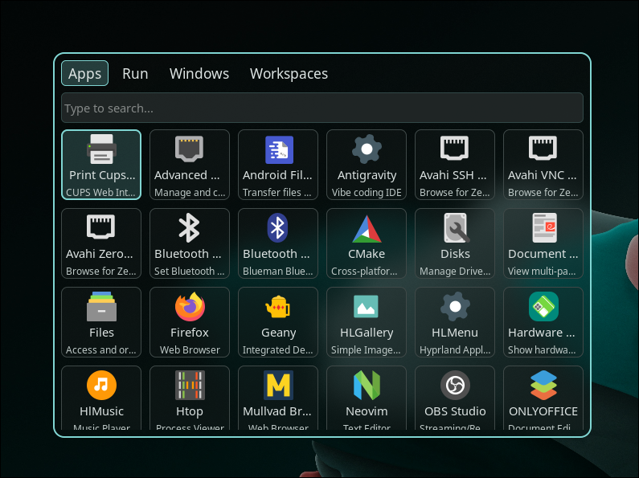
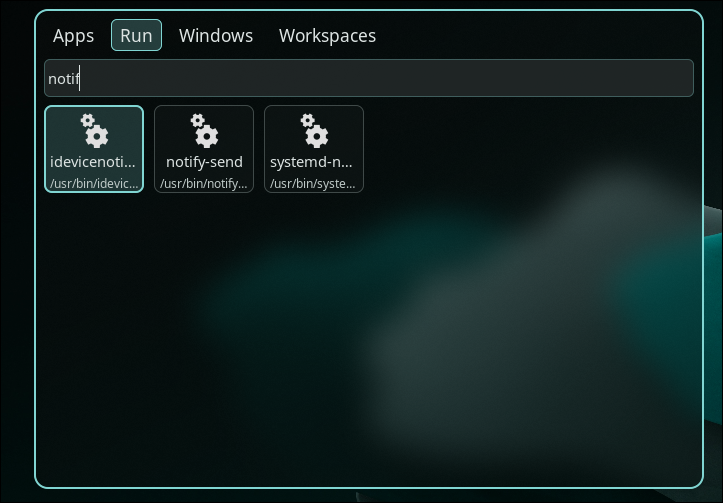
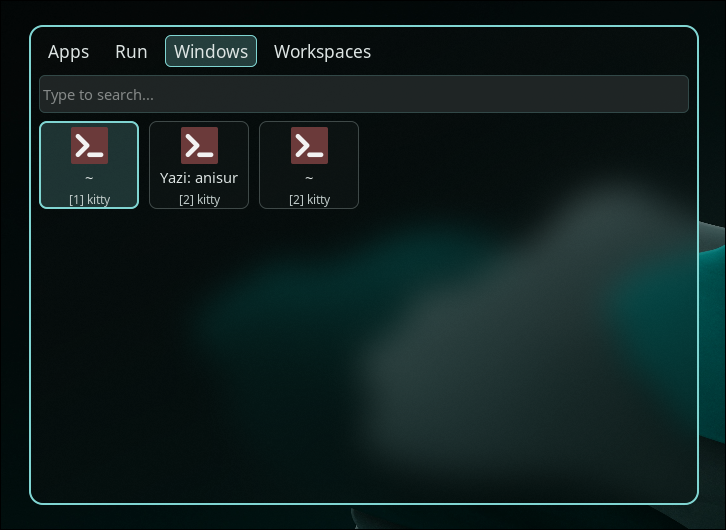
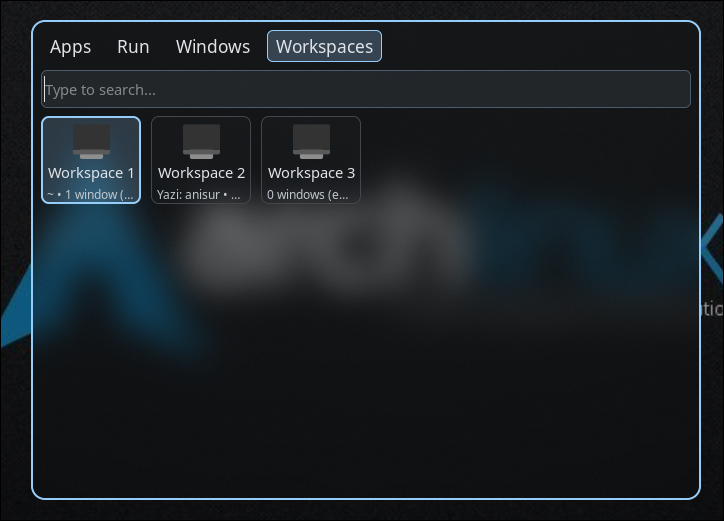
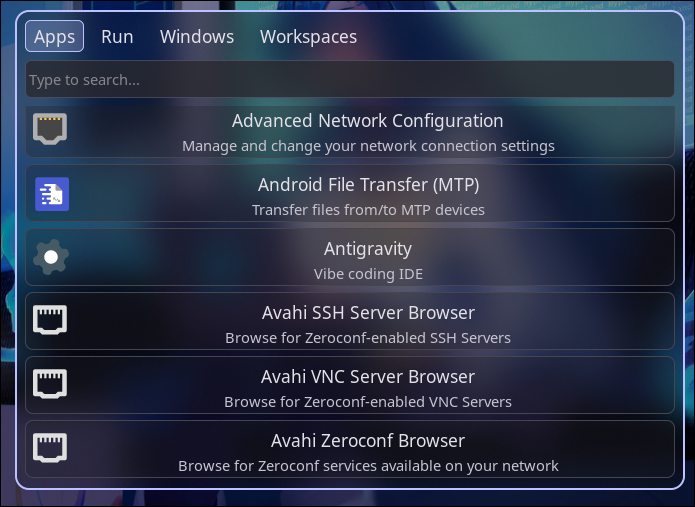
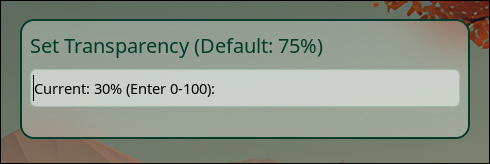
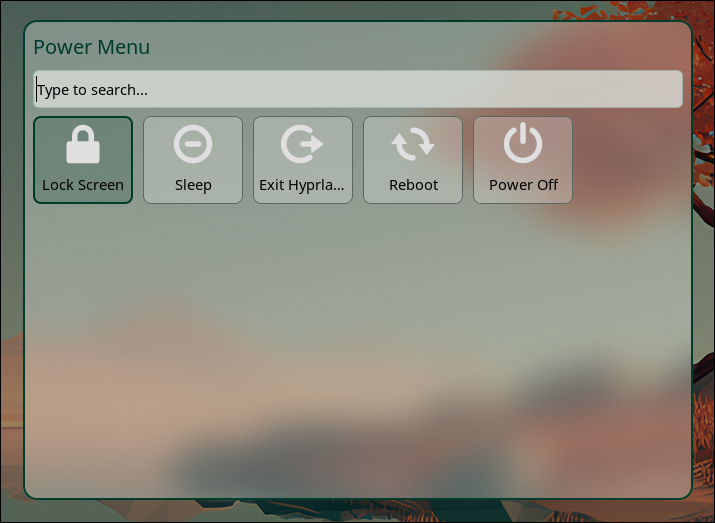

# hlmenu

<p align="center">
  
</p>

<p align="center">
  <strong>Modern, GPU-Accelerated Application Launcher, Command Runner & Dynamic Menu for Hyprland and Wayland</strong>
</p>

<p align="center">
  <a href="#-overview">Overview</a> •
  <a href="#-screenshots">Screenshots</a> •
  <a href="#-key-features">Key Features</a> •
  <a href="#-installation">Installation</a> •
  <a href="#-command-line-arguments-reference">CLI Reference</a> •
  <a href="#-in-depth-modes-guide--examples">Modes Guide</a> •
  <a href="#-keybindings--navigation">Keybindings</a> •
  <a href="#-configuration-guide-hlmenuconf">Configuration</a> •
  <a href="#-practical-recipes--scripts">Recipes</a>
</p>

---

## 🌟 Overview

**`hlmenu`** is a native, ultra-fast application launcher, window switcher, command runner, and dynamic menu designed specifically for **Hyprland** and modern Wayland compositors. Built directly on top of the official **Hyprtoolkit** UI widget framework, `hlmenu` delivers native Wayland layer-shell integration, hardware-accelerated rendering, buttery smooth 60fps animations, and instantaneous response times.

Whether used as a daily desktop application launcher, a quick window manager, a system command runner (`rofi run` / `dmenu` replacement), an image wallpaper selector, or a custom scriptable menu (power menus, clipboard managers), `hlmenu` offers deep customization with pixel-perfect Catppuccin-inspired styling out of the box.

---

## 📸 Screenshots









---

## ✨ Key Features

* 🚀 **Multi-Mode Tabbed Switcher**: Combine multiple modes (`Apps`, `Run`, `Windows`, `Workspaces`, `Files`, `Images`) in a single menu session and cycle between them seamlessly with `Shift + Left / Right` or mouse clicks.
* ⚡ **High-Performance `$PATH` Run Launcher**: Discovers thousands of executable system binaries across `$PATH` with in-memory caching and lazy viewport windowing for sub-millisecond launch speeds.
* 🪟 **Direct Hyprland IPC Socket Integration**: Instant client window switching and workspace focusing via native Hyprland UNIX domain sockets without spawning external processes.
* 🎨 **Dual Presentation Views**:
  * **Responsive Grid View**: Elegant card tiles with icon scaling, adaptive centering, and dynamic subtitles.
  * **Single-Column List View**: Sleek rows with crisp typography and glowing selection highlights.
  * **In-Place Toggle**: Switch between Grid and List views instantly with `Ctrl + Escape`.
* 🔍 **Zero-Allocation Real-Time Search**: Instant, zero-heap substring and fuzzy filtering across item titles, descriptions, and file paths.
* 🖼️ **Thumbnail Previews**: Built-in image browser mode for choosing wallpapers, screenshots, and visual assets with automatic thumbnail caching.
* 📜 **Scriptable Custom Menus**: Fully compatible with piped dmenu/rofi workflows (`--mode options`, `--dmenu`, and `--onclick`).
* 🔇 **Silent by Default**: Zero terminal noise or debug clutter when invoked by keybinds or shell scripts.
* ⚙️ **Configurable Geometry & Aesthetics**: Simple INI-style configuration file (`hlmenu.conf`) controlling every pixel of dimensions, paddings, gaps, colors, borders, and typography.

---

## 📦 Installation

### Prerequisites & Dependencies

`hlmenu` requires a modern C++23 compiler and the following libraries:

| Dependency | Package Name (Arch / Fedora / Debian / Ubuntu) | Description |
| :--- | :--- | :--- |
| **Hyprtoolkit** | `hyprtoolkit` / `hyprtoolkit-git` | Hyprland official UI widget framework |
| **Hyprutils** | `hyprutils` / `hyprutils-git` | Core utilities and memory primitives |
| **Hyprgraphics** | `hyprgraphics` / `hyprgraphics-git` | Graphic and font rendering support |
| **Wayland Client** | `wayland`, `wayland-protocols` | Wayland client and protocol bindings |
| **xkbcommon** | `libxkbcommon` | Keyboard layout and keysym parsing |
| **Cairo & Pango** | `cairo`, `pango` | 2D vector graphics and text rendering |
| **CMake** | `cmake` (>= 3.20) | Build system generator |

### Building and Installing

Clone the repository and build using the automated build script:

```bash
git clone https://github.com/your-username/hlmenu.git
cd hlmenu

# User-space install (recommended, installs to ~/.local without root):
./make.sh

# Or system-wide install (all users):
sudo ./make.sh /usr/local
```

`./make.sh` automatically configures CMake, builds with `--parallel`, and installs:
- **Binary**: `<prefix>/bin/hlmenu` (`~/.local/bin/hlmenu` by default)
- **Desktop Entry**: `<prefix>/share/applications/hlmenu.desktop`
- **Assets**: `<prefix>/share/hlmenu/placeholderappicon.png`
- **Configuration**: Default config files (`hlmenu.conf`, `custom.conf`) are auto-created at `~/.config/hlmenu/` on first run if not present.

#### Manual Build with CMake (Alternative)

```bash
cmake -B build -DCMAKE_BUILD_TYPE=Release -DCMAKE_INSTALL_PREFIX=~/.local
cmake --build build --parallel
cmake --install build
```

---


## 📋 Command-Line Arguments Reference

`hlmenu` provides a flexible and intuitive CLI interface:

| Option | Short / Aliases | Expected Value | Description |
| :--- | :--- | :--- | :--- |
| `--mode` | `-m`, `--modes` | `<mode1,mode2,...>` | Operating mode(s) to load. Can be a single mode or a comma-separated list of combined modes. |
| `--view` | `-v` | `grid` \| `list` | Visual layout style. Overrides the `default-mode` setting in configuration. |
| `--view-<mode>` | *(None)* | `grid` \| `list` | Mode-specific view layout override (e.g. `--view-windows list --view-images grid`). |
| `--source` | `-s` | `<path>` \| `<string>` | Global target directory for `files` / `images`, or delimited string for `options`. |
| `--source-<mode>` | *(None)* | `<path>` \| `<string>` | Mode-specific source override (e.g. `--source-files ~/Docs --source-images ~/Pics`). |
| `--title` | `-t` | `<text>` | Custom top bar header title (or static title for single mode). |
| `--title-<mode>` | *(None)* | `<text>` | Custom tab label override (e.g. `--title-options "Power" --title-files "Documents"`). |
| `--onclick` | `--on-click` | `<command_template>` | Global command template executed on item activation (for `files`, `images`, `options`). |
| `--onclick-<mode>` | `--on-click-<mode>` | `<command_template>` | Mode-specific on-click override (e.g. `--onclick-files "echo %f" --onclick-images "xdg-open %f"`). |
| `--prompt` | `-p`, `--placeholder` | `<text>` | Custom search bar placeholder / prompt text (e.g. `-p "Search..."`). |
| `--query` | `-q`, `--filter` | `<text>` | Pre-filled search query on startup (e.g. `--query ".pdf"`). |
| `--password` | `--mask`, `--hidden` | *(None)* | Masks typed characters with password dots (●) for sensitive input/passwords. |
| `--format` | `-i` | `string` \| `index` | Output selected string or 0-based numerical index to stdout. |
| `--size` | `--window-size` | `<WxH>` | Custom window pixel dimensions override (e.g. `--size 420x220`). |
| `--anchor` | `--pos`, `--position` | `<pos>` | Window screen position: `center`, `top`, `bottom`, `left`, `right`, `top-left`, `top-right`, etc. |
| `--no-search` | `--no-searchbar` | *(None)* | Hide the SearchBar for compact dialogs and popups. |
| `--no-title` | `--no-titlebar` | *(None)* | Hide the TitleBar / header row. |
| `--no-subtitles` | `--no-subtitle` | *(None)* | Temporarily disable item subtitles/descriptions. |
| `--dmenu` | *(None)* | *(None)* | Drop-in standard input dmenu/rofi pipe mode. |
| `--config` | `-c`, `--conf` | `<path>` | Custom path to a `hlmenu.conf` configuration file. |
| `--verbose` | `--debug` | *(None)* | Enables verbose debug logging to stdout (silent by default). |
| `--help` | `-h` | *(None)* | Displays help information and keybindings. |

---

## 🎛️ In-Depth Modes Guide & Examples

`hlmenu` supports **7 distinct operating modes**, each designed for specific desktop workflows:

```
Available Modes: apps | run | windows | workspaces | files | images | options
```

---

### 1. 🚀 Applications Mode (`--mode apps` / `-m apps`)

Discovers and launches all installed desktop applications by parsing standard FreeDesktop `.desktop` files according to XDG specifications.

* **Searchable Fields**: Application Name (`Name`), Generic Name (`GenericName`), and Description (`Comment`).
* **Precedence Order**: `~/.local/share/applications` (user overrides) ➔ User Flatpaks ➔ System Flatpaks ➔ Snaps ➔ `/usr/share/applications`. Duplicate desktop files are automatically deduplicated.
* **Icons**: Automatically resolves icons from your active icon theme (Papirus, Adwaita, Breeze, etc.).
* **Native Launching**: Selecting an application automatically launches it in the background using its official `.desktop` `Exec=` definition.

#### Examples:

```bash
# Launch application menu in default Grid View
hlmenu --mode apps

# Launch application menu in Single-Column List View
hlmenu --mode apps --view list
```

---

### 2. ⚡ Command / Binary Runner Mode (`--mode run` / `-m run`)

A high-performance system executable launcher that scans all directories in your `$PATH` (`/usr/bin`, `/usr/local/bin`, `~/.local/bin`, etc.) similar to `rofi -show run` or `wofi --show run`.

* **Instant Discovery**: In-memory caching and lazy viewport windowing ensure sub-millisecond launch across 5,000+ system binaries.
* **Direct Execution**: Selecting an executable runs it detached in the background (`binary &`).
* **Arbitrary Command Execution**: You can type any command with arguments (e.g. `fastfetch --logo-type kitty` or `bash script.sh`) into the SearchBar and press `Enter` to run it directly, even if no binary item is selected!

#### Examples:

```bash
# Launch binary runner in Grid View
hlmenu --mode run

# Launch binary runner in List View (shows binary name + full path subtitle)
hlmenu --mode run --view list
```

---

### 3. 🪟 Windows Mode (`--mode windows` / `-m windows`)

Queries the active Hyprland compositor socket to list all currently open application windows and client surfaces.

* **Zero-Latency IPC**: Connects directly to `$XDG_RUNTIME_DIR/hypr/$HYPRLAND_INSTANCE_SIGNATURE/.socket.sock`.
* **Details**: Shows window title, application class, and workspace tag (e.g. `[1] kitty` or `[2] Firefox`).
* **Action**: Selecting a window instantly shifts focus and switches to the corresponding workspace.

#### Examples:

```bash
# Launch window switcher in List View (ideal for quick Alt+Tab replacement)
hlmenu --mode windows --view list

# Launch window switcher in Grid View
hlmenu --mode windows --view grid
```

---

### 4. 🌐 Workspaces Mode (`--mode workspaces` / `-m workspaces`)

Queries Hyprland to enumerate all active workspaces, open window counts, active window titles, and monitor assignments.

* **Information Displayed**: Workspace Name/ID, Active Window Title, Total Windows on Workspace, and Assigned Monitor (e.g. `eDP-1`).
* **Action**: Selecting a workspace switches focus to that workspace immediately.

#### Examples:

```bash
# Launch workspace switcher in List View
hlmenu --mode workspaces --view list

# Launch workspace switcher in Grid View
hlmenu --mode workspaces --view grid
```

---

### 5. 📁 File Browser Mode (`--mode files` / `-m files`)

Scans a target directory specified by `--source <dir>` and displays files and folders with system file icons.

* **Default Behavior (No `--onclick` passed)**: Selecting any file or folder **prints its absolute file path (`%f`) to `stdout`** and exits `0`. Perfect for shell scripting and piped workflows!
* **Custom Action Template (`--onclick`)**:
  * `%f` = Full absolute file path (e.g. `/home/user/Documents/report.pdf`)
  * `%n` = File name (e.g. `report.pdf`)

#### Examples:

```bash
# Default: Prints chosen file path to stdout (no --onclick needed!)
SELECTED_FILE=$(hlmenu --mode files --source ~/Documents)

# Open selection with default desktop application (xdg-open)
hlmenu --mode files --source ~/Documents --onclick "xdg-open %f"

# Browse Code directory and open selected file in Neovim inside a terminal
hlmenu --mode files --source ~/Code --onclick "kitty nvim %f" --title "Project Files"

# Browse Downloads in List View
hlmenu --mode files --source ~/Downloads --view list --onclick "xdg-open %f"
```

---

### 6. 🖼️ Image & Wallpaper Browser (`--mode images` / `-m images`)

Scans a directory for image files (`.png`, `.jpg`, `.jpeg`, `.webp`, `.gif`, `.bmp`, `.svg`) and displays high-resolution previews in a responsive grid.

* **Default Behavior (No `--onclick` passed)**: Selecting an image **prints its absolute file path (`%f`) to `stdout`** and exits `0`.
* **Thumbnail Generation**: Automatically scales and caches image previews for fast scrolling.
* **Custom Action Template (`--onclick`)**: Supports `%f` (image path) and `%n` (image filename).

#### Examples:

```bash
# Default: Prints chosen image path to stdout
WALLPAPER=$(hlmenu --mode images --source ~/Pictures/Wallpapers)

# Wallpaper Picker with swww wallpaper daemon
hlmenu --mode images --source ~/Pictures/Wallpapers --title "Select Wallpaper" --onclick "swww img %f --transition-type wipe"

# Wallpaper Picker with hyprpaper
hlmenu --mode images --source ~/Pictures/Wallpapers --onclick "hyprctl hyprpaper wallpaper 'eDP-1,%f'"

# Screenshot viewer and editor with swappy
hlmenu --mode images --source ~/Pictures/Screenshots --title "Screenshots" --onclick "swappy -f %f"
```

---

### 7. 📜 Custom Scriptable Options (`--mode options` / `-m options`)

Accepts custom delimited options for building interactive menus, power menus, screenshot selectors, and dynamic scripts.

* **Default Behavior (No `--onclick` passed)**: Selecting an option **prints its selected name/action (`%a`) to `stdout`** and exits `0`.

#### A. Simple Comma-Separated List:
Format: `"Item 1, Item 2, Item 3"`

```bash
# Default: Outputs selected option directly to stdout
CHOICE=$(hlmenu --mode options --source "Option A, Option B, Option C")

# With custom on-click action (%a = action/selected item, %n = display name)
hlmenu --mode options --source "Low, Medium, High, Ultra" --title "Performance Profile" --onclick "notify-send 'Profile Set' '%a'"
```

#### B. Multiline / Newline-Delimited List (Comma-Safe):
When your item text contains commas, quotes, or colons (e.g. city names, task descriptions, command flags), use **newlines (`\n`)** so commas are not split into separate items:

```bash
# Items with commas are preserved as single complete lines:
OPTIONS="New York, NY
Los Angeles, CA
Austin, TX"

CHOICE=$(hlmenu --mode options --source "$OPTIONS")

# Or with ANSI-C quoting:
CHOICE=$(hlmenu --mode options --source $'Git: commit, push, pull\nDocker: build, run, stop\nSystem: update, reboot')
```

#### C. Structured List with Icons & Commands:
Format per item: `icon, Display Name, command` separated by semicolons (`;`).

```bash
# Full-featured Power Menu with system icons and commands
hlmenu --mode options \
       --source "system-lock-screen, Lock, hyprlock; system-log-out, Logout, hyprctl dispatch exit; system-suspend, Suspend, systemctl suspend; system-reboot, Reboot, systemctl reboot; system-shutdown, Shutdown, systemctl poweroff" \
       --title "Power Menu" \
       --view grid
```

#### D. Screenshot Menu:
```bash
# Interactive screenshot selector
hlmenu --mode options \
       --source "camera, Full Screen, grim ~/Pictures/$(date +%s).png; selection, Select Area, grim -g \"$(slurp)\" ~/Pictures/$(date +%s).png; window, Active Window, grim -g \"$(hyprctl activewindow -j | jq -r '\"\(.at[0]),\(.at[1]) \(.size[0])x\(.size[1])\"')\" ~/Pictures/$(date +%s).png" \
       --title "Screenshot Tool" \
       --view list
```

#### E. Piped Standard Input & 100% `dmenu` / `rofi` Compatibility:

`hlmenu` is a **100% drop-in replacement for `dmenu` and `rofi -dmenu`**, but with much greater flexibility. While classic `rofi -dmenu` is strictly limited to reading piped standard input, `hlmenu` supports **all 3 input methods**:

| Input Method | Syntax Example | Notes |
| :--- | :--- | :--- |
| **1. Direct CLI Argument** | `hlmenu --dmenu --source "A, B, C"` | 🚀 **Exclusive to `hlmenu`** (no pipes or subshells needed!) |
| **2. Piped Standard Input (`\|`)** | `echo -e "A\nB\nC" \| hlmenu --dmenu` | 100% drop-in replacement for `rofi -dmenu` & `dmenu` |
| **3. File Redirection (`<`)** | `hlmenu --dmenu < items.txt` | Reads items directly from text file |

##### Quick Drop-in Script Examples:

```bash
# 1. Direct CLI Argument (No pipes needed!)
CHOICE=$(hlmenu --dmenu --source "Apple, Banana, Cherry")

# 2. Piped command output
CHOICE=$(printf "Option 1\nOption 2\nOption 3" | hlmenu --dmenu)

# 3. Numeric index output (-i / --format index for easy case statements)
INDEX=$(printf "Low\nMedium\nHigh" | hlmenu --dmenu -i)

# 4. Clipboard history selector (with cliphist)
cliphist list | hlmenu --dmenu --view list | cliphist decode | wl-copy

# 5. Password / Sensitive input prompt (masked with dots ●)
PASS=$(hlmenu --dmenu --source "" --prompt "Enter Password:" --password --size 400x130 --no-title)
```

* **Cancellation & Exit Codes**:
  * **`0`**: Item was selected (selection printed to `stdout`).
  * **`1`**: User cancelled or pressed <kbd>Escape</kbd> (ensures clean abort handling in scripts: `CHOICE=$(cmd | hlmenu --dmenu) || exit 0`).

---

### 🔀 Combined Multi-Mode Launcher (Tabbed Header)

Combine multiple modes in a single session! `hlmenu` renders interactive tabs in the TitleBar allowing instant switching:

```bash
# Default launch: combines Apps, Run, Windows, and Workspaces
hlmenu

# Combine Apps, Windows, and Workspaces in List View
hlmenu --modes apps,windows,workspaces --view list

# Combine Apps, Run, and Files (defaults to browsing $HOME in Files tab)
hlmenu --modes apps,run,files

# Combine Apps, Run, and Files targeting a specific folder
hlmenu --modes apps,run,files --source ~/Documents --onclick "xdg-open %f"

# Combine Files and Images with independent actions and directories
hlmenu --modes files,images \
       --source-files ~/Documents \
       --onclick-files "echo %f" \
       --source-images ~/Pictures/Wallpapers \
       --onclick-images "swww img %f --transition-type wipe"
```

#### 💡 How `--source` Works in Combined Modes:
* **Smart Defaults (No `--source` passed)**:
  * **`Files`** tab automatically defaults to your user home folder (`$HOME` / `~`).
  * **`Images`** tab automatically defaults to your wallpapers/pictures folder (`~/Pictures`).
* **Explicit `--source <path>`**:
  * Passing `--source ~/Projects` targets that specific directory for the `Files` (or `Images`) tab, while `Apps`, `Run`, `Windows`, and `Workspaces` tabs seamlessly continue querying their respective system paths!

* **Navigate Tabs**: Use **`Shift + Right`** / **`Shift + Left`** or click directly on any tab pill in the TitleBar.

---

## ⌨️ Keybindings & Navigation

| Keybinding | Context | Action |
| :--- | :--- | :--- |
| **`Arrow Up` / `Down`** | All Views | Move selection cursor up / down |
| **`Arrow Left` / `Right`** | Grid View | Move selection cursor left / right across columns |
| **`PageUp` / `PageDown`** | All Views | Scroll one full page up or down dynamically |
| **`Home` / `End`** | All Views | Jump directly to the first or last item |
| **`Shift + Right`** | Combined Modes | Switch to the next mode tab (`Apps` ➔ `Run` ➔ `Windows` ➔ `Workspaces`) |
| **`Shift + Left`** | Combined Modes | Switch to the previous mode tab (`Workspaces` ➔ `Windows` ➔ `Run` ➔ `Apps`) |
| **`Ctrl + Escape`** | All Views | **Toggle between Grid View and List View in-place** |
| **`Enter`** | All Views | Activate selected item / execute typed command / focus window / switch workspace |
| **`Escape`** | All Views | Close `hlmenu` immediately (exits code `1`) |
| **`Left Mouse Click`** | TitleBar / View | Select and activate an item, or click on any TitleBar tab |

---

## 🎨 Configuration Guide (`hlmenu.conf`)

`hlmenu` automatically loads configuration from:
```
~/.config/hlmenu/hlmenu.conf
```
If this file does not exist on first launch, `hlmenu` automatically creates it with the bundled Obsidian Dark theme.

### 📁 Custom Configuration File Loading (`--config` / `-c`)

You can create multiple theme/geometry profiles (e.g. a compact popup theme, a full-screen launcher theme, or a light theme) and load any of them on demand:

```bash
# Load a custom compact config file
hlmenu --config ~/.config/hlmenu/compact.conf

# Short alias:
hlmenu -c ~/.config/hlmenu/compact.conf --mode options --source "Yes, No, Cancel"
```

### ⚡ CLI Argument Precedence (Overrides Config File)

`hlmenu` follows a strict **precedence hierarchy**:

$$\textbf{CLI Arguments} \;\;>\;\; \textbf{Loaded Config File (\texttt{hlmenu.conf})} \;\;>\;\; \textbf{Built-in Defaults}$$

**Key Rule**: Any parameter specified on the command line (e.g. `--size 420x220`, `--anchor top`, `--prompt "Search..."`, `--no-title`, `--view list`) will **always override** the corresponding setting in your `hlmenu.conf` for that invocation only. Your configuration file on disk is never modified.

```bash
# Even if hlmenu.conf sets window-size = 670x480 and default-mode = grid,
# this invocation runs as a 400x200 List View anchored to the top:
hlmenu --size 400x200 --anchor top --view list --mode run
```

### Complete `hlmenu.conf` Reference

```ini
# ==============================================================================
# HLMENU CONFIGURATION FILE
# ==============================================================================

# --- Window Geometry & Appearance ---
window-size = 670x480                # Width x Height in pixels (670px gives 6 card columns)
window-padding = 10                  # Outer padding between window border and content
margin-top-left = 0,0                # Margins from top-left anchor (X,Y)
margin-bottom-right = 0,0            # Margins from bottom-right anchor (X,Y)
anchor = 0                           # Window position: 0=Center, 1=Top, 2=Bottom, 4=Left, 8=Right

# --- Window Backdrop & Border ---
background = #181825f5               # Semi-transparent dark background (#RRGGBBAA)
border-color = #89b4faff             # Sapphire window border color
border-size = 2                      # Window border thickness in pixels
corner-radius = 14                   # Window rounded corner radius

# --- Typography & Global Theme ---
font-family = Sans                   # Primary UI font family
monospace-font = monospace           # Monospace font for code/subtitles
icon-pack = Papirus                  # Icon theme pack name
default-mode = grid                  # Default view presentation: "grid" or "list"

# --- Title Bar (Header / Mode Switcher Tabs) ---
show-titlebar = true                 # Toggle TitleBar visibility
titlebar-height = 32                 # Dedicated pixel height for TitleBar row
titlebar-gap = 8                     # Vertical gap between TitleBar and SearchBar
show-mode-tabs = true                # Enable interactive mode tabs in multi-mode launches
titlebar-title = Applications        # Default title text when tabs are disabled
titlebar-title-font-size = 15        # Title typography size
titlebar-title-font-color = #89b4faff # Title font color

# --- Search Bar ---
show-searchbar = true                # Toggle SearchBar visibility
searchbar-height = 38                # Dedicated pixel height for search input
searchbar-gap = 8                    # Gap between SearchBar and content list/grid
search-placeholder = Type to search... # Placeholder text
search-placeholder-color = #a6adc8aa # Placeholder font color
search-font-size = 13                # Search input font size
search-font-color = #cdd6f4ff        # Search input text color
search-background = #313244cc        # Search bar container background
search-border-color = #89b4fa88      # Search bar border color
search-border-size = 1               # Search bar border thickness
search-corner-radius = 8             # Search bar corner rounding

# --- Subtitles Toggle ---
# Controls subtitles across all modes in both List and Grid views.
# Note: If an item does not have a subtitle, it is automatically centered cleanly.
show-subtitles = true

# --- Grid View & Items (Card-styled tiles) ---
grid-item-width = 100                # Width of each card tile (px)
grid-item-height = 88                # Height of each card tile (px)
grid-item-horizontal-gap = 10        # Horizontal gap between grid columns
grid-item-vertical-gap = 10          # Vertical gap between grid rows
grid-item-corner-radius = 8          # Corner rounding of card tiles
grid-item-icon-size = 44             # Icon size in card tiles (px)
grid-item-padding = 6                # Internal padding of card tiles
grid-item-font-size = 11             # Card title font size
grid-item-desc-font-size = 9         # Card subtitle font size
grid-item-desc-font-color = #a6adc8cc # Card subtitle font color
grid-auto-center-horizontal = false   # Dynamically center grid cards when all items fit in a single row (default: false)

# Resting Card Appearance
grid-item-background = #1e1e2ecc     # Default tile background fill
grid-item-border-color = #313244ff   # Default tile border
grid-item-border-size = 1            # Default tile border thickness
grid-item-font-color = #cdd6f4ff     # Default title font color

# Active / Selected Card (Glowing Accent)
grid-item-active-background = #89b4fa33 # Glowing selection background fill
grid-item-active-border-color = #89b4faff # Glowing sapphire border
grid-item-active-border-size = 2     # Active border thickness
grid-item-active-font-color = #89b4faff # Active font color

# --- List View & Rows (Row-styled items) ---
list-item-height = 42                # Height of each row (px)
list-items-vertical-gap = 6          # Gap between rows (px)
list-item-corner-radius = 8          # Corner rounding of rows
list-item-icon-size = 36             # Icon size in list rows (px)
list-item-padding = 8                # Internal padding of list rows
list-item-title-font-size = 13       # Row title font size
list-item-desc-font-size = 11        # Row subtitle font size

# Resting Row Appearance
list-item-background = #1e1e2ecc     # Default row background fill
list-item-border-color = #313244ff   # Default row border
list-item-border-size = 1            # Default row border thickness
list-item-title-font-color = #cdd6f4ff # Default title font color
list-item-desc-font-color = #a6adc8ff # Default subtitle font color

# Active / Selected Row (Glowing Accent)
list-item-active-background = #89b4fa33 # Glowing selection background fill
list-item-active-border-color = #89b4faff # Glowing sapphire border
list-item-active-border-size = 2     # Active border thickness
list-item-active-title-font-color = #89b4faff # Active title font color
```

---

## 💡 Practical Recipes & Scripts

### 1. Hyprland Integration (`~/.config/hypr/hyprland.conf`)

Add these ergonomic keybindings to your Hyprland configuration:

```ini
# Main Application Launcher (Default Multi-Mode)
bind = SUPER, Space, exec, hlmenu

# Quick Command & Binary Runner
bind = SUPER, R, exec, hlmenu --mode run

# Open Windows & Clients Switcher (List View)
bind = SUPER, Tab, exec, hlmenu --mode windows --view list

# Workspaces & Windows Overview
bind = SUPER, W, exec, hlmenu --modes windows,workspaces --view list

# Custom Power Menu
bind = SUPER, Backspace, exec, ~/.local/bin/powermenu.sh

# Wallpaper Selector
bind = SUPER, P, exec, ~/.local/bin/wallpaper-picker.sh
```

---

### 2. Standalone Power Menu Script (`~/.local/bin/powermenu.sh`)

```bash
#!/usr/bin/env bash

OPTIONS="system-lock-screen, Lock Screen, hyprlock; \
system-log-out, Log Out, hyprctl dispatch exit; \
system-suspend, Suspend, systemctl suspend; \
system-reboot, Restart System, systemctl reboot; \
system-shutdown, Power Off, systemctl poweroff"

hlmenu --mode options \
       --source "$OPTIONS" \
       --title "Power Menu" \
       --view grid
```

Make it executable:
```bash
chmod +x ~/.local/bin/powermenu.sh
```

---

### 3. Wallpaper Selector Script (`~/.local/bin/wallpaper-picker.sh`)

```bash
#!/usr/bin/env bash

WALLPAPER_DIR="$HOME/Pictures/Wallpapers"

hlmenu --mode images \
       --source "$WALLPAPER_DIR" \
       --title "Select Wallpaper" \
       --view grid \
       --onclick "swww img %f --transition-type wipe --transition-duration 1.5"
```

Make it executable:
```bash
chmod +x ~/.local/bin/wallpaper-picker.sh
```

---

## 🛠️ Architecture & Technical Highlights

* **Pure C++23 Architecture**: Modern language features, `std::variant` zero-copy polymorphism, and `std::string_view` search indexing.
* **Direct Wayland Layer-Shell**: Runs on layer 3 (Overlay) with keyboard interactivity (`kbInteractive(1)`) and zero window displacement (`exclusiveZone(-1)`).
* **Native Hyprland UNIX IPC**: Direct socket communication (`.socket.sock`) for lightning-fast client and workspace switching without subshell overhead.
* **Lazy Incremental Windowing**: Dynamically manages visible UI widgets so that large datasets (5,000+ binaries) render in under $2\text{ms}$.
* **Zero Console Noise**: Silent execution by default with opt-in `--verbose` / `HT_DEBUG=1` logging.

---

## 📄 License

This project is licensed under the **BSD 3-Clause License**. See the `LICENSE` file for details.
